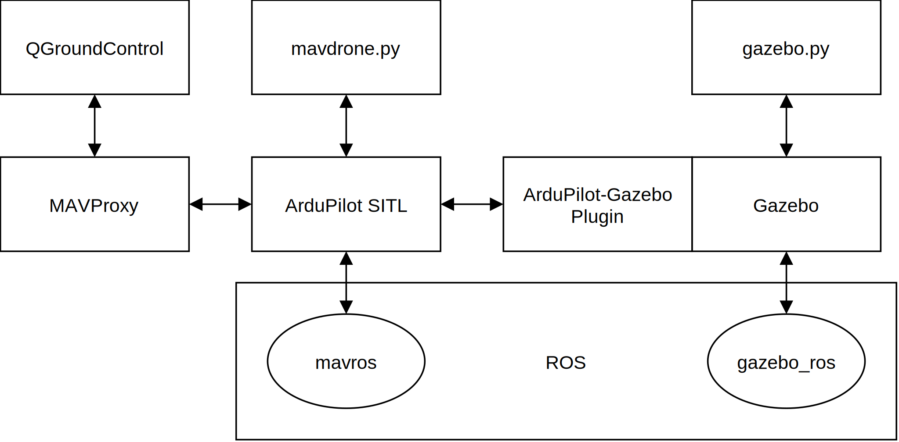
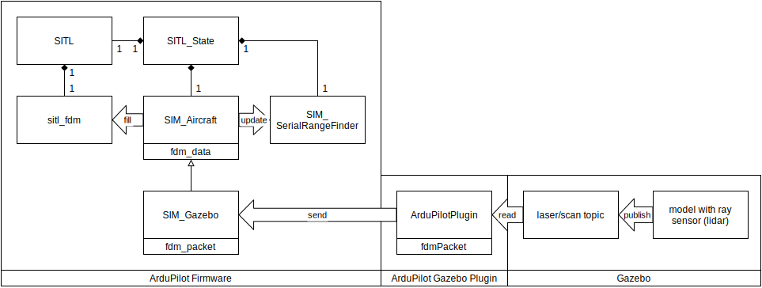
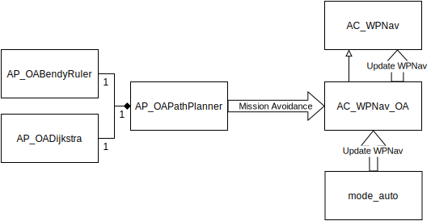

# Helium
A drone synthetic environment development project based on Ardupilot, Gazebo & ROS.

## Learning the Basics
[https://github.com/ParasInternKhushPatil/ardupilot-gazebo-ros-guide]

## Installation

### Installation Script
From the terminal:  
`wget -O - https://raw.githubusercontent.com/ParasInternKhushPatil/helium/master/docs/install.bash | bash`

This installation script is modified based on the installation from https://github.com/ParasInternKhushPatil/ardupilot-gazebo-ros-guide. Refer to it for more details. It installs the following prerequisites and setups this repository. Note that this repository is a catkin package. Please restart after the installation.

### Prerequisites
#### Main SITL Stack
- ArduPilot (Modified)
- ArduPilot Gazebo Plugin (Modified)
- Gazebo 11
- ROS Noetic
- MAVROS
#### Supporting Stack
- Catkin Workspace & Helium Package
- QGroundControl (QGC)
- Google Protobufs
    - Generate Python Bindings for Gazebo Protobuf Messages
- Python Libraries
    - pymavlink
    - protobuf

## Software Architecture Overview


## Starting the SITL Stack
### Manually
1. Open four terminals in the home directory (Tip: Ctrl-Alt-T + Ctrl-Shift-T x4)
2. In each:
    1. roslaunch Gazebo world  
    `roslaunch helium hills_lidar.launch`
    2. Start ArduPilot SITL  
    `sim_vehicle.py -v ArduCopter -f gazebo-iris`
        - Will need to compile (for first time)
        - Wait for `APM: EKF2 IMU1 tilt alignment complete` before continuing to step 3
        - Initialisation is completed when `APM: EKF2 IMU1 is using GPS`
            - Then you can start sending MAVLink commands & interface with MAVProxy
    3. Start MAVROS  
    `roslaunch helium apm.launch`
    4. Start QGroundControl  
    `./QGroundControl.AppImage`

### Automatically
Note: Run it via the gnome terminal.
1. Start: `bash run.bash`
2. Stop: `ctrl-c`

## Repository Guide
1. docs
    - Contains documentation, diagrams, installation script, code examples
2. launch
    - Contains ROS launch files
    - `apm.launch` starts MAVROS
    - The rest starts Gazebo worlds within ROS
3. models
    - Contains Gazebo models
4. worlds
    - Contains Gazebo worlds
5. src
    - Contains SITL Code
    - `mavdrone.py`
        - Module for communicating with the drone via MAVLink
        - Uses pymavlink beneath to handle MAVLink messages.
    - `gazebo.py`
        - Module for retrieving Gazebo topic messages.
        - Uses protobuf to parse `gztopic` text formatted messages.
    - `time_mission.py`
        - Code example for uploading and timing drone missions
    - `multi_drone.py`
        - Code example for multi_drone simulation 
6. `setup.bash`
    - Is sourced in `.bashrc`
    - Setups Gazebo world and model paths

## Tips
1. To change directory to helium quickly:
    - `roscd helium`

## Bugs Found
1. During a mission land command, if terrain following is enabled, the drone will keep flying higher.

## Features Implemented for ArduCopter SITL
For ArduCopter Version: 4.0.4-dev

In Forked Repositories:

- ArduPilot  
https://github.com/yanhwee/ardupilot

- ArduPilot Gazebo Plugin (khancyr)  
https://github.com/yanhwee/ardupilot_gazebo

### 1. Terrain Following
1. References
    1. https://discuss.ardupilot.org/t/gazebo-with-lidar/24717/6

2. Psuedo-Diagram  
    

3. Walk-through  
    1. SIM_Gazebo
        1. Modify the FDM Packet to receive the rangefinder value. 
        2. Then, moidfy the function that updates the range value (in SIM_Gazebo) using the received rangefinder value.
    
    2. ArduPilotPlugin.hh/.cc
        1. Modify the FDM Packet to take in the rangefinder value. 
        2. Use Gazebo transport node to read laser topic messages published by laser ray model.

    3. Gazebo  
        1. Create a model file for Lidar.
        2. Use ray sensors with one laser. 
        3. Add this lidar model to iris_with_ardupilot, using links and joints.
            - Laser topic messages is automatically published.

4. ArduPilot Parameters
    1. References
        1. https://ardupilot.org/copter/docs/terrain-following.html
    2. By QGroundControl or MAVProxy
        1. TERRAIN_ENABLE = 1 (Default)

5. Test
    1. QGroundControl
        1. Select MAVLink Inspector
        2. Find Distance Sensor
        3. Plot, 60 secs (optional)

    2. MAVProxy (Alternatively, less preferred way)
        1. https://ardupilot.org/dev/docs/using-sitl-for-ardupilot-testing.html#adding-a-virtual-rangefinder
        2. Don't `param set` anything
        3. Just load the graph

### 2. Object Avoidance
1. References
    1. https://github.com/ArduPilot/ardupilot/issues/5608
    2. https://answers.gazebosim.org//question/18881/publish-a-gazebo-message-into-a-ros-topic/

2. Walk-through
    1. Gazebo
        1. Create model file for 360 lidar.
            1. Ensure the lasers are setup in a "circular" manner
                - Actually clockwise or not it doesn't matter
                    - Rather, ArduPilot parameter, `PRX_ORIENT`, controls the orientation of the proximity sensors
                - Just ensure that `min_angle` starts from 0
                - Don't overlap the first and last laser
                ```
                <samples>n</samples>
                <min_angle>0</min_angle>
                <max_angle>-x<max_angle>
                <!-- where x = 2pi / n * (n - 1) -->
                ```
        2. But this time, publish laser messages via MAVROS.
            1. Use a Gazebo Plugin, "libgazebo_ros_laser.so".
            2. Set publish topic target directly to "/mavros/obstacle/send".
                - It is a mavros rostopic that takes in Gazebo laser messages.
        3. Put lidar model on top of the iris_with_ardupilot using links and joints.

    2. Catkin Workspace
        1. Use roslaunch to run Gazebo. Create a launch file for that.
            - This is for "libgazebo_ros_laser.so", to be able to publish laser messages to rostopic.

3. ArduPilot Parameters
    1. References
        1. https://ardupilot.org/copter/docs/common-simple-object-avoidance.html
        2. https://ardupilot.org/copter/docs/common-oa-bendyruler.html
    2. By QGroundControl or MAVProxy
        1. AVOID_ENABLE = 7 (or any values that includes "Proximity Sensors")
        2. PRX_TYPE = 2 (MAVLink)
        3. PRX_ORIENT = 1 (Upside Down)
        4. OA_TYPE = 1 (BendyRuler)

4. Test
    1. Via Terminal
        1. `rostopic echo /mavros/obstacle/send`
    2. QGroundControl
        1. Ensure ArduPilot Parameter, `OA_DB_OUTPUT` >= 2 (Send HIGH and NORMAL importance item)
        2. Obstacle icons should show up on main GUI

### 3. Terrain Following with Object Avoidance
The current version of ArduCopter does not allow terrain following if object avoidance is enabled.

1. Psuedo-Diagram  
    

2. Walk-through
    1. Regardless whether OA is enabled, `AC_WPNav_OA` will always be used rather than `AC_WPNav`. `AC_WPNav_OA::update_wpnav()` will always call `AC_WPNav::update_wpnav()` at the end. The main problem lies within `AC_WPNav_OA`.
    2. `AP_OAPathPlanner` uses threading to process and adjust the waypoints. Sometimes, it isn't ready and will return `AP_OAPathPlanner::OA_Processing`.
    3. A switch case in `AC_WPNav_OA` handles the results. However, if the `OAPathPlanner` is still processing, a false boolean will disable terrain following (for that waypoint). (This might be a bug?)
    4. Since the check occurs so frequently, terrain following will be disabled for all waypoints throughout the mission.
    5. The fix is to replace the false boolean to `_terrain_alt`, a boolean that stores the state of terrain following, true if enabled and false otherwise.

### 4. Multi-Drone Simulation
To be honest, the implementation for multi-drone simulation is very inelegant and unscalable.

1. References:
    1. https://github.com/Intelligent-Quads/iq_tutorials/blob/master/docs/swarming_ardupilot.md
    2. https://github.com/Intelligent-Quads/iq_tutorials/blob/master/docs/multi_mavros_drones.md

2. Walk-through
    1. Segregrate the FDM ports of the drone model so ArduPilot (sim_vehicle.py) can correctly connect to the drone plugin.
        1. Duplicate the existing drone model
            1. `iris_with_lidar` -> `iris_with_lidar_2`
            2. `iris_with_ardupilot` -> `iris_with_ardupilot_2`
        2. Change the include model (in `iris_with_lidar`)
            1. `<uri>model://iris_with_ardupilot</uri>` -> `<uri>model://iris_with_ardupilot_2</uri>`
        3. Change the FDM Ports by 10 (in `iris_with_ardupilot_2`)
            1. `<fdm_port_in>9002</fdm_port_in>` -> `<fdm_port_in>9012</fdm_port_in>`
            2. `<fdm_port_out>9003</fdm_port_out>`-> `<fdm_port_out>9013</fdm_port_out>`
    2. Create another MAVROS instance for the new drone
        1. Duplicate the existing `apm.launch` file
            1. `apm.launch` -> `apm2.launch`
        2. Change certain parameters
            1. Increment `fcu_url` by 10
            2. Increment `target_url` by 1
            3. Add & Set `ns` to `/drone2`
        3. Ensure that the new drone model use the new ROS topic
            1. Duplicate the lidar 360 model
                - `lidar_360` -> `lidar_360_2`
            2. Change the ROS topic name
                - `/mavros/obstacle/send` -> `/drone2/mavros/obstacle/send`
    3. Fix QGroundControl to allow multiple drones
        1. Navigate to the ArduPilot Repository (`~/ardupilot/Tools/autotest`)
            1. Duplicate the existing ArduPilot startup parameter file (in `./default_params`)
                1. `gazebo-iris` -> `gazebo-iris-2`
                2. Append `SYSID_THISMAV 2` to end of file
            2. Register this new parameter file (in `./pysim/vehicleinfo.py`)
                - (See references)
3. Test
    1. Start the Gazebo World in ROS
        - `roslaunch helium flat_multi.launch`
    2. Start the ArduCopter instances
        - `sim_vehicle.py -v ArduCopter -f gazebo-iris -I0 --out=tcpin:0.0.0.0:8100`
        - `sim_vehicle.py -v ArduCopter -f gazebo-iris-2 -I1 --out=tcpin:0.0.0.0:8200`
    3. Start the MAVROS instances
        - `roslaunch helium apm.launch`
        - `roslaunch helium apm2.launch`
    4. Start QGroundControl
        - Settings -> Comm Links -> Add
            - Name: Drone 2
            - Type: TCP
            - TCP Port: 8200
        - Ok -> Drone 2 -> Connect
